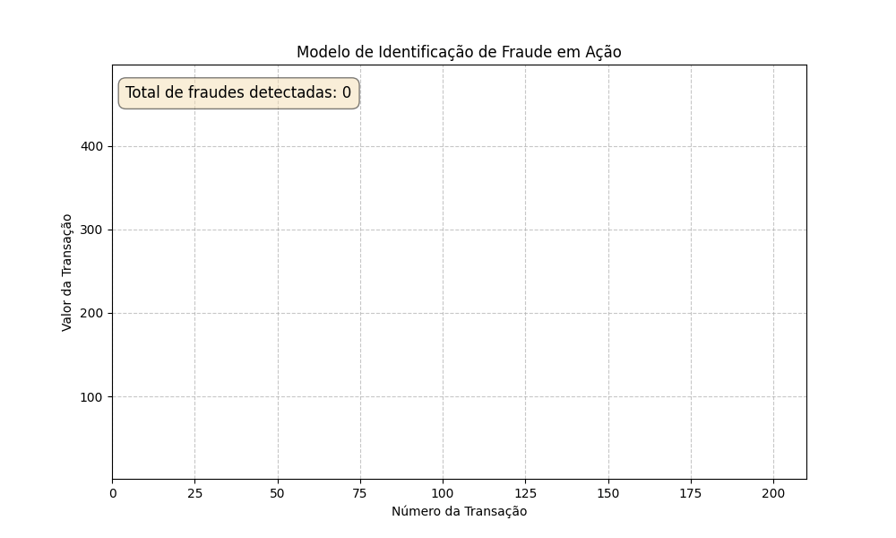

# Fraud Detection Animation

[](https://opensource.org/licenses/MIT)

Este projeto apresenta uma animação interativa demonstrando o funcionamento de um modelo de identificação de fraude. A visualização exibe transações financeiras fictícias em tempo real, destacando aquelas suspeitas de fraude com base em um limiar de risco. O objetivo é proporcionar uma compreensão clara e dinâmica de como um sistema de detecção de fraudes pode atuar.

## 🚀 Demonstração

Veja a animação do modelo de detecção de fraude em ação:

<p align="center">
  
</p>

## 🎯 Objetivo

O principal objetivo é visualizar a evolução de transações financeiras e a detecção de fraudes em tempo real. A animação busca tornar o conceito de detecção de anomalias mais acessível, mostrando a distinção entre transações normais e fraudulentas à medida que os dados são processados.

## 💻 Tecnologias Utilizadas

* **Python**: Linguagem principal do projeto.
* **Matplotlib**: Utilizado para criar as visualizações e animações dinâmicas.
* **NumPy**: Essencial para a geração e manipulação dos dados numéricos simulados.
* **Pillow**: Biblioteca necessária para o Matplotlib salvar a animação no formato GIF.
* **Jupyter Notebook**: Ambiente de desenvolvimento interativo para execução e visualização do código.

## ⚙️ Como Funciona

1.  **Geração de Dados Sintéticos**: O código simula transações financeiras com valores e riscos associados, onde algumas transações são marcadas como fraudulentas.
2.  **Visualização em Tempo Real**: Cada ponto no gráfico representa uma transação. Transações normais são exibidas em azul, enquanto transações detectadas como fraude são destacadas em vermelho.
3.  **Contagem de Fraudes**: Um contador é atualizado na animação para exibir o número total de fraudes identificadas até o momento, proporcionando uma métrica visual do desempenho da detecção.
4.  **Animação e Salvamento**: A evolução das transações e a detecção de fraudes são animadas e salvas como um arquivo GIF, facilitando a visualização e compartilhamento em plataformas como o GitHub.

## 🚀 Como Executar

Para rodar este projeto em seu ambiente local, siga os passos abaixo:

1.  **Clone o repositório**:

    ```bash
    git clone [https://github.com/SeuNomeDeUsuario/Fraud_Detection_Animation.git](https://github.com/SeuNomeDeUsuario/Fraud_Detection_Animation.git)
    cd Fraud_Detection_Animation
    ```

2.  **Instalar as dependências**:
    Certifique-se de ter as bibliotecas necessárias instaladas. Recomenda-se criar um ambiente virtual.

    ```bash
    python -m venv venv
    source venv/bin/activate  # No Windows, use `venv\Scripts\activate`
    pip install -r requirements.txt
    ```

3.  **Rodar o Código**:
    O código principal para a geração da animação está no arquivo `777_Modelo de Identificação de Fraude em Ação.ipynb`. Você pode executá-lo em um ambiente Jupyter Notebook ou Jupyter Lab:

    ```bash
    jupyter notebook "777_Modelo de Identificação de Fraude em Ação.ipynb"
    ```

    Após a execução do notebook, o GIF da animação será salvo na pasta `media/`.

## 🤝 Contribuições

Contribuições são bem-vindas! Se você tiver ideias para melhorias, novas funcionalidades ou encontrar algum problema, sinta-se à vontade para abrir uma *issue* ou enviar um *pull request*.

## 📄 Licença

Este projeto está licenciado sob a Licença MIT - veja o arquivo [LICENSE](LICENSE.md) para mais detalhes.

## 📧 Contato

Se você tiver alguma dúvida ou sugestão, entre em contato:

* **Nome**: Flávio Henrique Barbosa
* **LinkedIn**: [Flávio Henrique Barbosa | LinkedIn](https://www.linkedin.com/in/fl%C3%A1vio-henrique-barbosa-38465938)
* **Email**: flaviohenriquehb777@outlook.com

---
